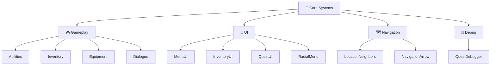

<!--
   ______  _     _     _          _____  _   _   _ 
  |  ____|(_)   | |   | |        |  __ \| \ | | | |
  | |__    _  __| | __| |_   ___ | |__) |  \| | | |
  |  __|  | |/ _` |/ _` \ \ / / |  ___/| . ` | | |
  | |____ | | (_| | (_| |\ V /  | |    | |\  | |_|
  |______||_|\__,_|\__,_| \_/   |_|    |_| \_| (_)
-->

<div align="center">

# ✨ Finding Oneself

### *Экспериментальная RPG о пони, потерявшей память*

<br>

[](https://unity.com)
[]()
[]()
[]()

<br>


</div>

---

<table align="center">
<tr>
<td align="center">
  <strong>🎮 Жанр</strong><br>RPG / Эксперимент
</td>
<td align="center">
  <strong>🎨 Визуал</strong><br>AI-генерируемый
</td>
<td align="center">
  <strong>🧠 Логика</strong><br>AI-ассистируемая
</td>
<td align="center">
  <strong>⚡ Статус</strong><br>Прототип
</td>
</tr>
</table>

---

## 🎯 О проекте

<div align="center">

> *"Визуал и часть логики создаются с помощью нейросетей. Эксперимент — насколько ИИ может помочь соло-разработчику."*

</div>

**Finding Oneself** — это экспериментальная RPG, где пони **Трикси** просыпается в шахте без воспоминаний. Ей предстоит заново учиться, сражаться и собирать отряд в опасном Вечнозеленом лесу и за его пределами.

---

## 🎭 Сюжет

<div align="center">

| 🌟 Что предстоит героине |
|:------------------------:|
| 🔄 Заново научиться всему с нуля |
| ⚔️ Набить руку в бою |
| 👥 Собрать верный отряд по всему миру |
| 🔍 Раскрыть тайну своего прошлого |

</div>

> *Вечнозеленый лес — лишь первая глава в большой истории.*

---

## 🤖 Ключевая особенность

<table align="center">
<tr>
<th>🎨 Визуал</th>
<th>🧠 Логика</th>
<th>📝 Контент</th>
</tr>
<tr>
<td align="center">Арты персонажей, фоны, текстуры<br><br><strong>Генерируется через ИИ</strong></td>
<td align="center">Игровые механики<br><br><strong>Создаётся с помощью ИИ</strong></td>
<td align="center">Идеи, тексты, диалоги<br><br><strong>Создаётся с помощью ИИ</strong></td>
</tr>
</table>

---

## 🛠 Технологический стек

<table align="center">
<tr>
<td align="center">🎮 <strong>Движок</strong></td>
<td>Unity 6000.4.8f1</td>
</tr>
<tr>
<td align="center">💻 <strong>Язык</strong></td>
<td>C#</td>
</tr>
<tr>
<td align="center">🤖 <strong>ИИ-инструменты</strong></td>
<td>Stable Diffusion, ChatGPT</td>
</tr>
<tr>
<td align="center">📦 <strong>Контроль версий</strong></td>
<td>Git + GitHub</td>
</tr>
<tr>
<td align="center">⚡ <strong>Система событий</strong></td>
<td>Кастомная (ScriptableObject + JSON)</td>
</tr>
<tr>
<td align="center">📜 <strong>Квестовая система</strong></td>
<td>Кастомная (ScriptableObject + JSON)</td>
</tr>
<tr>
<td align="center">🖥️ <strong>UI</strong></td>
<td>Unity UI + TextMeshPro</td>
</tr>
</table>

---

## 🏗 Архитектура проекта



<details>
<summary><b>📋 Подробное описание модулей</b></summary>

- **Ядро (Core Systems):** EventManager, EventStateManager, FlagManager, QuestManager
- **Игровая логика (Gameplay):** Abilities, Inventory, Equipment, Dialogue
- **Пользовательский интерфейс (UI):** MenuUIManager, InventoryUI, DialogueUI, QuestUI, RadialMenu
- **Навигация (Navigation):** LocationNeighbors, NavigationArrow
- **Отладка (Debug):** QuestDebugger

</details>

---

## 📁 Структура проекта

<details>
<summary><b>📂 Развернуть структуру</b></summary>

```
finding-oneself/
│
├── Assets/
│   ├── Scripts/
│   │   ├── Core/
│   │   │   ├── EventSystem/
│   │   │   │   ├── EventManager.cs
│   │   │   │   ├── EventStateManager.cs
│   │   │   │   ├── EventDataManager.cs
│   │   │   │   ├── GameEvent.cs
│   │   │   │   ├── EventAction.cs
│   │   │   │   ├── EventContext.cs
│   │   │   │   ├── EventTypes.cs
│   │   │   │   └── EventConverter.cs
│   │   │   ├── FlagManager.cs
│   │   │   └── GlobalControl.cs
│   │   ├── Gameplay/
│   │   │   ├── Abilities/
│   │   │   │   ├── Ability.cs
│   │   │   │   ├── AbilityManager.cs
│   │   │   │   └── MagicLightAbility.cs
│   │   │   ├── Inventory/
│   │   │   │   ├── InventoryUIManager.cs
│   │   │   │   ├── InventorySlot.cs
│   │   │   │   ├── InventoryItemMarker.cs
│   │   │   │   ├── ItemSO.cs
│   │   │   │   ├── ItemData.cs
│   │   │   │   ├── ItemType.cs
│   │   │   │   └── ItemDatabase.cs
│   │   │   ├── Equipment/
│   │   │   │   ├── EquipmentSystem.cs
│   │   │   │   └── EquipmentSlot.cs
│   │   │   ├── Dialogue/
│   │   │   │   ├── TextBeginner.cs
│   │   │   │   ├── DialogueData.cs
│   │   │   │   ├── DialogueUI.cs
│   │   │   │   ├── DialogueFileManager.cs
│   │   │   │   ├── DialogueCharacterManager.cs
│   │   │   │   └── DialogueTrigger.cs
│   │   │   └── Quests/
│   │   │       ├── QuestManager.cs
│   │   │       ├── QuestUI.cs
│   │   │       ├── QuestInstance.cs
│   │   │       ├── QuestSO.cs
│   │   │       ├── QuestConfigSO.cs
│   │   │       ├── QuestListItem.cs
│   │   │       ├── QuestNotifications.cs
│   │   │       └── QuestDebugger.cs
│   │   ├── UI/
│   │   │   ├── Menu/
│   │   │   │   ├── MenuUIManager.cs
│   │   │   │   ├── MenuUIConfig.cs
│   │   │   │   ├── PanelManager.cs
│   │   │   │   ├── BackgroundManager.cs
│   │   │   │   ├── TabManager.cs
│   │   │   │   ├── UIBuilder.cs
│   │   │   │   └── FindingOneselfAnimation.cs
│   │   │   ├── RadialMenu/
│   │   │   │   ├── RadialMenu.cs
│   │   │   │   ├── RadialButton.cs
│   │   │   │   ├── RadialMenuOpener.cs
│   │   │   │   └── MenuManager.cs
│   │   │   ├── TooltipManager.cs
│   │   │   ├── ItemViewPanel.cs
│   │   │   └── MenuCloseHandler.cs
│   │   └── Navigation/
│   │       ├── LocationNeighbors.cs
│   │       ├── NavigationArrow.cs
│   │       ├── LocationArrows.cs
│   │       ├── SceneSlideTransition.cs
│   │       └── SceneTransition.cs
│   ├── Editor/
│   │   ├── QuestSOEditor.cs
│   │   ├── GameEventEditor.cs
│   │   ├── ItemSOEditor.cs
│   │   ├── QuestConfigEditor.cs
│   │   ├── MenuUIConfigEditor.cs
│   │   ├── DialogueDataEditor.cs
│   │   ├── EventDataRestorer.cs
│   │   └── EventEditorHelper.cs
│   ├── Resources/
│   │   ├── Quests/
│   │   ├── Items/
│   │   ├── Configs/
│   │   └── UI/
│   ├── Scenes/
│   │   ├── MainScene.unity
│   │   └── ...
│   ├── TextAssets/
│   │   └── Texts/
│   │       ├── ReplicProlouge.txt
│   │       └── Trixie.txt
│   └── EventsData/
│       ├── *.json
│       └── Backups/
│           └── *.json
├── README.md
├── LICENSE
└── .gitignore
```
</details>

---

## ✅ Что уже готово

### 🧠 Событийная система
<details>
<summary><b>📖 Подробнее</b></summary>


**Возможности:**
- ✅ 12 типов триггеров (PickupItem, EnterLocation, DialogueEnd и др.)
- ✅ 4 политики выполнения
- ✅ Условия выполнения и дополнительные условия
- ✅ Зависимости и взаимные исключения
- ✅ 15+ типов действий
- ✅ Вложенные действия (if/else)
- ✅ Сохранение в JSON и восстановление
- ✅ Автосохранение при компиляции и смене режимов
- ✅ Создание бэкапов

**Ключевые файлы:** `EventManager`, `EventStateManager`, `EventDataManager`, `GameEvent`, `EventAction`, `EventContext`, `EventConverter`
</details>

### 📜 Квестовая система
<details>
<summary><b>📖 Подробнее</b></summary>


**Возможности:**
- ✅ 6 типов квестов
- ✅ 6 типов целей
- ✅ Условия старта (флаги, завершение других квестов)
- ✅ Награды (предметы, опыт, флаги)
- ✅ Интеграция с диалогами
- ✅ Панель с вкладками
- ✅ Прогресс-бары, детальная панель, отслеживание
- ✅ Уведомления при старте, обновлении и завершении
- ✅ Отладчик с панелью (F12)
- ✅ Сохранение и загрузка состояния

**Ключевые файлы:** `QuestManager`, `QuestUI`, `QuestInstance`, `QuestSO`, `QuestConfigSO`, `QuestNotifications`, `QuestDebugger`
</details>

### 🎒 Инвентарь
<details>
<summary><b>📖 Подробнее</b></summary>


**Возможности:**
- ✅ Drag-and-drop между слотами
- ✅ Двойной клик для быстрого снятия
- ✅ Контекстное меню (ПКМ)
- ✅ Стэкинг и разделение стэка
- ✅ Визуальное отображение, тултипы
- ✅ Панель просмотра предмета
- ✅ База данных предметов
- ✅ Предметы как ScriptableObject

**Ключевые файлы:** `InventoryUIManager`, `InventorySlot`, `InventoryItemMarker`, `ItemSO`, `ItemDatabase`, `ItemViewPanel`
</details>

### ⚔️ Экипировка
<details>
<summary><b>📖 Подробнее</b></summary>


**Возможности:**
- ✅ 10+ типов экипировки
- ✅ Экипировка через перетаскивание в слот
- ✅ Снятие через двойной клик или контекстное меню
- ✅ Визуальное отображение на модели через систему пивотов
- ✅ Отключение коллизий и физики на экипированных предметах

**Ключевые файлы:** `EquipmentSystem`, `EquipmentSlot`
</details>

### 💬 Диалоговая система
<details>
<summary><b>📖 Подробнее</b></summary>


**Возможности:**
- ✅ Загрузка диалогов из `.txt` файлов
- ✅ Поддержка маркеров: `choice`, `finish`, `continue`, `end`
- ✅ Появление персонажей с анимациями
- ✅ Перемещение персонажей между локациями
- ✅ Кнопка пропуска диалога
- ✅ Настройка через ScriptableObject

**Ключевые файлы:** `TextBeginner`, `DialogueData`, `DialogueUI`, `DialogueFileManager`, `DialogueCharacterManager`
</details>

### 🎮 Главное меню
<details>
<summary><b>📖 Подробнее</b></summary>


**Возможности:**
- ✅ Анимация букв "Finding Oneself" с подсветкой
- ✅ Появление Trixie со светом
- ✅ Плавные переходы между панелями
- ✅ Панель настроек с вкладками
- ✅ Настройки: разрешение, качество, VSync, громкость, музыка, звуки, голос, чувствительность, инверсия Y, схема управления, вибрация, язык, сложность, автосохранение
- ✅ Сброс прогресса с уведомлением
- ✅ Панель выхода с подтверждением

**Ключевые файлы:** `MenuUIManager`, `MenuUIConfig`, `PanelManager`, `BackgroundManager`, `TabManager`, `UIBuilder`, `FindingOneselfAnimation`
</details>

### 🌀 Радиальное меню
<details>
<summary><b>📖 Подробнее</b></summary>


**Возможности:**
- ✅ 4 типа отображения (Circle, Fan, Vertical, Horizontal)
- ✅ Главное меню с действиями
- ✅ Контекстное меню для предметов
- ✅ Поддержка выбора в диалогах
- ✅ Управление через ПКМ

**Ключевые файлы:** `RadialMenu`, `RadialButton`, `MenuManager`, `RadialMenuOpener`
</details>

### 🗺️ Навигация
<details>
<summary><b>📖 Подробнее</b></summary>


**Возможности:**
- ✅ Автоматическое обнаружение соседей локаций
- ✅ Переход со слайд-анимацией
- ✅ Поддержка клавиатурных стрелок
- ✅ Персонаж перемещается вместе с камерой

**Ключевые файлы:** `LocationNeighbors`, `NavigationArrow`, `SceneSlideTransition`
</details>

### 🐞 Отладка
<details>
<summary><b>📖 Подробнее</b></summary>

**Возможности:**
- ✅ Панель с логами (F12)
- ✅ Отслеживание старта, обновления, завершения квестов
- ✅ Отслеживание выполнения событий
- ✅ Проверка прогресс-баров

**Ключевые файлы:** `QuestDebugger`
</details>

---

## 🛠 Редакторские инструменты


| Редактор | Назначение |
|:---------|:-----------|
| **QuestSOEditor** | Визуальный редактор квестов с русскими названиями и подсказками |
| **GameEventEditor** | Редактор событий с поддержкой вложенных действий и отображением состояния |
| **ItemSOEditor** | Редактор предметов с группировкой полей |
| **QuestConfigEditor** | Настройка цветов, размеров и текстов квестовой системы |
| **MenuUIConfigEditor** | Все настройки UI в одном месте |
| **DialogueDataEditor** | Настройка тегов, маркеров и поведения диалогов |
| **EventDataRestorer** | Автоматическое восстановление событий из JSON |
| **EventEditorHelper** | Утилиты для работы с событиями и бэкапами |
| **DebuggerWindow** | Кастомное окно отладки с фильтрацией по модулям, цветовой маркировкой, поиском, экспортом и гибкими настройками |

---

## 🐞 Система отладки (Logger)

<details>
<summary><b>📖 Подробнее</b></summary>

**Возможности:**
- ✅ Иерархическая система логирования с разделением по модулям
- ✅ 14+ модулей: Core, UI, Dialogue, Event, Inventory, Menu, Navigation, QuestSystem, RadialMenu, Abilities, Audio, Animation, Save, Editor
- ✅ Цветовое кодирование модулей для быстрого визуального восприятия
- ✅ Кастомное окно отладки с фильтрацией по модулям
- ✅ Выпадающие списки для удобного управления фильтрами
- ✅ Фильтрация по типам логов (обычные, ошибки, предупреждения)
- ✅ Текстовый поиск по сообщениям
- ✅ Автоскролл и очистка логов
- ✅ Экспорт отфильтрованных логов в текстовый файл
- ✅ Автоматическое удаление дублирующихся модулей из сообщений
- ✅ Мгновенное переключение видимости модулей

**Ключевые файлы:** `Logger.cs`, `DebuggerWindow.cs`
</details>

## 🤝 Как помочь

<table align="center">
<tr>
<td align="center">🎨 <strong>Идеи</strong></td>
<td align="center">🧠 <strong>Нейросети</strong></td>
<td align="center">🖼️ <strong>Арт</strong></td>
<td align="center">💻 <strong>Код</strong></td>
<td align="center">☀️ <strong>Поддержка</strong></td>
</tr>
<tr>
<td align="center">Сюжет, механики, квесты, мир</td>
<td align="center">Освоение инструментов, промпты, контент</td>
<td align="center">Генерация картинок, текстур, спрайтов</td>
<td align="center">Скрипты, баги, оптимизация, рефакторинг</td>
<td align="center">Тестирование, фидбек, репосты</td>
</tr>
</table>

> **Присоединяйтесь через Pull Request или пишите в Telegram!**

---

## 👥 Команда

<table align="center">
<tr>
<td align="center">
  <strong>👤 Walderman</strong><br>
  <em>Соло-разработчик</em><br>
  <a href="https://github.com/Walderman1">GitHub</a> • <a href="https://t.me/VValderman">Telegram</a>
</td>
</tr>
</table>

> *Проект открыт для контрибьюторов! Присоединяйтесь! 🦄*

---

## 📊 Статус разработки

<table align="center">
<tr>
<td>Передвижение и взаимодействие</td>
<td align="right">✅ Готово</td>
</tr>
<tr>
<td>Базовая нейро-арт</td>
<td align="right">✅ Готово</td>
</tr>
<tr>
<td>Событийная система</td>
<td align="right">✅ Готово</td>
</tr>
<tr>
<td>Квестовая система</td>
<td align="right">✅ Готово</td>
</tr>
<tr>
<td>Инвентарь</td>
<td align="right">✅ Готово</td>
</tr>
<tr>
<td>Экипировка</td>
<td align="right">✅ Готово</td>
</tr>
<tr>
<td>Диалоговая система</td>
<td align="right">✅ Готово</td>
</tr>
<tr>
<td>Главное меню</td>
<td align="right">✅ Готово</td>
</tr>
<tr>
<td>Радиальное меню</td>
<td align="right">✅ Готово</td>
</tr>
<tr>
<td>Навигация</td>
<td align="right">✅ Готово</td>
</tr>
<tr>
<td>Отладка</td>
<td align="right">✅ Готово</td>
</tr>
<tr>
<td>Редакторские инструменты</td>
<td align="right">✅ Готово</td>
</tr>
<tr>
<td colspan="2"><hr></td>
</tr>
<tr>
<td>Прокачка</td>
<td align="right">📝 Планируется</td>
</tr>
<tr>
<td>Крафт</td>
<td align="right">📝 Планируется</td>
</tr>
<tr>
<td>Система отряда</td>
<td align="right">📝 Планируется</td>
</tr>
<tr>
<td>Боевая система</td>
<td align="right">📝 Планируется</td>
</tr>
<tr>
<td>Множество локаций</td>
<td align="right">📝 Планируется</td>
</tr>
</table>

---

## 🙏 Благодарности

<div align="center">

> *Спасибо всем, кто поддерживает этот проект! 💜*

<br>

> *"Даже если ты потерял память, ты всегда можешь найти себя заново."*  
> — Трикси

</div>

---

## 🔗 Контакты

<div align="center">

[](https://t.me/VValderman)
[](https://github.com/Walderman1)

</div>

---

<div align="center">

### ⭐ Если вам нравится проект — поставьте звезду на GitHub! ⭐

</div>
